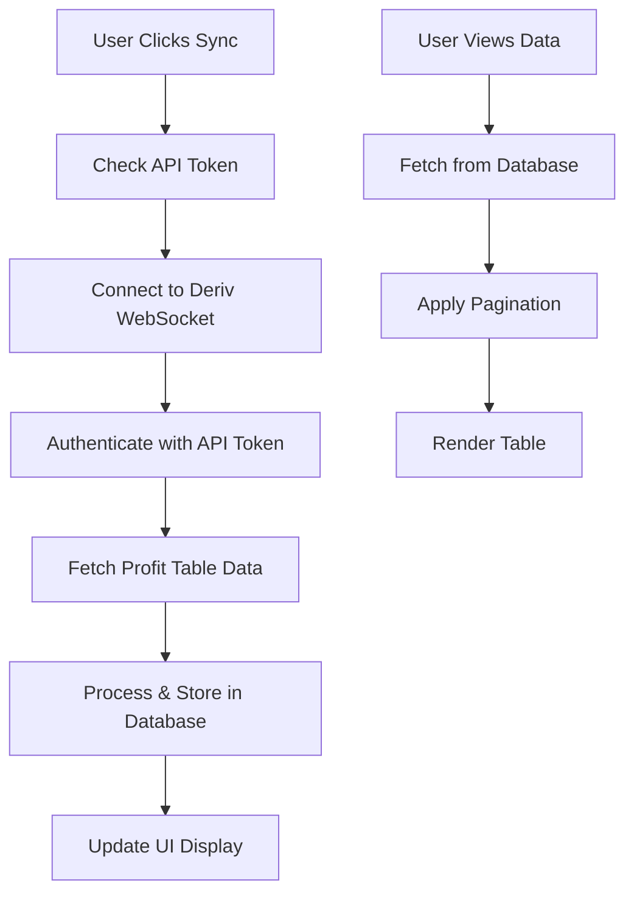

# Profit Table Feature Implementation

## Overview

The profit table feature provides comprehensive access to trading history data directly from the Deriv API. This feature allows users to sync and view their complete trading history with enhanced details beyond what's available in local trade records.

## Architecture

### Backend Components

#### 1. Deriv WebSocket Integration (`src/services/deriv-profit-table.ts`)
- **DerivProfitTableService**: Main service class for interacting with Deriv's profit_table API
- **WebSocket Connection**: Establishes secure connection to `wss://ws.binaryws.com/websockets/v3`
- **Batch Processing**: Handles large datasets by fetching data in configurable batches (default: 100 entries per request)
- **Incremental Sync**: Uses `skipDuplicates` to avoid re-importing existing records

#### 2. Database Schema (`prisma/schema.prisma`)
```prisma
model ProfitTableEntry {
  id             String   @id @default(uuid())
  userId         String
  derivAccountId String
  accountType    String
  contractId     BigInt
  transactionId  BigInt
  symbol         String?  // Underlying asset symbol
  longcode       String   // Full contract description
  shortcode      String   // Short contract code
  buyPrice       Int      // Stored in cents for precision
  sellPrice      Int?     // Stored in cents
  payout         Int      // Stored in cents
  profit         Int?     // Stored in cents
  purchaseTime   BigInt   // Unix timestamp
  sellTime       BigInt?  // Unix timestamp
  durationType   String?  // 't', 'm', 'h', 'd'
  duration       Int?     // Duration value
  // ... additional fields
}
```

#### 3. API Endpoints
- **GET `/api/profit-table`**: Retrieves paginated profit table data
  - Query params: `accountType`, `limit`, `offset`
  - Returns: `{ entries, pagination }`
- **POST `/api/deriv/sync-profit-table`**: Initiates sync from Deriv API
  - Body: `{ accountType: 'demo' | 'real' }`

### Frontend Components

#### 1. ProfitTableDisplay (`src/components/profit-table/profit-table-display.tsx`)
- **Paginated Table**: Shows 50 entries per page with navigation
- **Real-time Filtering**: Account type selection
- **Export Functionality**: CSV export with all relevant fields
- **Responsive Design**: Mobile-friendly table layout
- **Status Indicators**: Visual profit/loss badges with color coding

#### 2. ProfitTableSync (`src/components/profit-table/profit-table-sync.tsx`)
- **Sync Status**: Real-time sync progress indication
- **Token Validation**: Checks API token availability before sync
- **Error Handling**: Comprehensive error reporting and recovery
- **User Guidance**: Clear instructions and requirements

#### 3. Enhanced Trade History Page (`src/app/trade-history/page.tsx`)
- **Tabbed Interface**: Separates local trades from profit table data
- **Account Switching**: Easy toggle between demo and real accounts
- **Unified Experience**: Consistent UI across data sources

## Data Flow



## Key Features

### 1. **Comprehensive Data Sync**
- Fetches complete trading history from Deriv API
- Includes contract details, timing, and profit/loss information
- Supports both demo and real accounts
- Handles large datasets efficiently

### 2. **Enhanced Data Display**
- **Contract Information**: Contract ID, longcode, shortcode
- **Financial Data**: Buy/sell prices, payout, profit/loss
- **Timing Data**: Purchase time, sell time, duration
- **Market Data**: Underlying symbol, contract type

### 3. **User Experience**
- **Visual Indicators**: Color-coded profit/loss badges
- **Export Capabilities**: CSV export for external analysis
- **Responsive Design**: Works on desktop and mobile devices
- **Error Handling**: Clear error messages and recovery options

### 4. **Performance Optimization**
- **Database Indexing**: Optimized queries with proper indexes
- **Pagination**: Efficient large dataset handling
- **Caching**: Avoids redundant API calls
- **Batch Processing**: Handles sync operations in manageable chunks

## Security Considerations

- **API Token Protection**: Tokens stored securely in user settings
- **User Isolation**: Strict user-based data segregation
- **Authentication**: Server-side session validation
- **Data Validation**: Input sanitization and type checking

## Error Handling

### 1. **API Errors**
- Invalid tokens
- Network connectivity issues
- Deriv API rate limiting
- Account permission problems

### 2. **Database Errors**
- Connection failures
- Data validation errors
- Constraint violations

### 3. **User Interface Errors**
- Loading states
- Error messages with actionable guidance
- Graceful degradation

## Future Enhancements

1. **Advanced Filtering**
   - Date range selection
   - Symbol-based filtering
   - Profit/loss thresholds

2. **Analytics Dashboard**
   - Performance metrics
   - Trade success rates
   - Profit/loss trends

3. **Automated Sync**
   - Scheduled background syncing
   - Real-time data updates
   - Webhook integration

4. **Enhanced Export Options**
   - Multiple export formats (JSON, Excel)
   - Custom field selection
   - Date range exports

## Usage Instructions

1. **Initial Setup**
   - Configure Deriv API tokens in profile settings
   - Ensure demo/real account IDs are properly set

2. **Syncing Data**
   - Navigate to Trade History → Profit Table tab
   - Select account type (Demo/Real)
   - Click "Sync Now" button
   - Wait for sync completion

3. **Viewing Data**
   - Browse paginated results
   - Use export functionality for external analysis
   - Switch between account types as needed

4. **Troubleshooting**
   - Check API token configuration
   - Verify account permissions
   - Review error messages for specific issues

## Technical Notes

- All monetary values stored in cents (multiply by 100) for precision
- Timestamps stored as BigInt for Unix epoch compatibility
- WebSocket connections properly managed with cleanup
- Follows existing codebase patterns and TypeScript best practices
